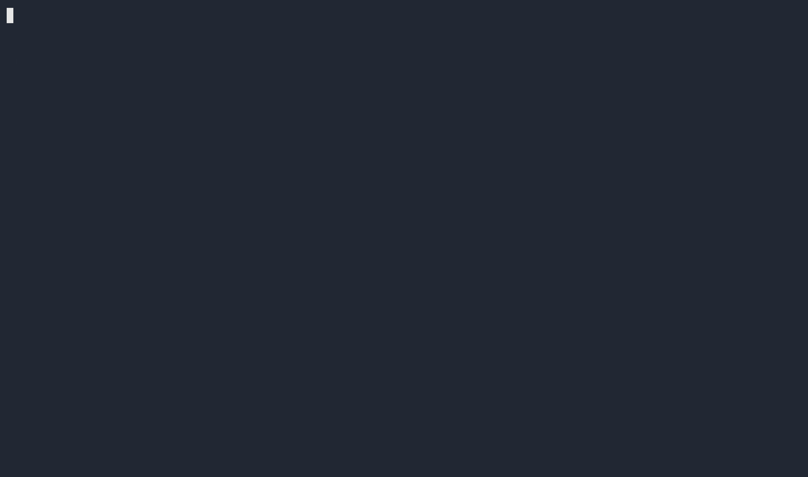

<!-- Meta: Birkin is agent safety infrastructure—cryptographic audit logs, kill switches, pre-execution gatekeeping. Not a crypto/token project. -->

<div align="center">
  
</div>

---

## ⚠️ Important Note

Birkin is a **security and governance framework for local AI agents**.  
It provides tamper-evident audit trails, deterministic drift checks, human-in-the-loop gatekeeping, and kill switches for autonomous agents.

**Birkin is not a cryptocurrency project.**
- We do not issue tokens.
- We do not have a wallet, a DAO, or a financial protocol.
- We are not associated with any token project using the name "Hermes," including the "UHMA" or "Hermes Mobile Agent" crypto initiatives.

If you're looking to trade tokens or vote on-chain with a "Hermes" token, you're in the wrong repo.  
If you're looking to **harden your AI agent**, prevent data leaks, and prove its behavior later—**you're in exactly the right place.**

---

# Birkin — The Seatbelt for Your Autonomous AI Agent

A hardened, local-first governance layer for AI agents.  
No tokens, no hype—just provable safety.

[](https://github.com/NickAiNYC/Birkin/actions/workflows/tamper-test.yml)
[](./)
[](./)
[](./)
[](./)


Birkin wraps a running [Hermes Agent](https://hermes-agent.nousresearch.com/) with a **SHA-256 hash-chained SQLite audit log**, a 5-gate governance check, an iPhone PWA, and kill switches — without modifying your Hermes install.

[](https://gitpod.io/#https://github.com/NickAiNYC/Birkin)

Or run locally in 30 seconds:

```bash
git clone https://github.com/NickAiNYC/Birkin.git && cd Birkin && docker compose up -d && docker exec -it birkin ./governance-check.sh
```

---

## The Tamper Test

Most audit logs are append-only by convention. Birkin's is hash-chained at the row level: every row stores `SHA-256(prev_hash || payload)`. Mutate a single byte anywhere in the hash-chained audit trail for AI agents and verification fails, even if database triggers were disabled first.

<div align="center">
  
</div>

Run it yourself:

```bash
./tests/tamper-test.sh
```

```text
Birkin tamper-detection test
[1/6]  schema initialized (table + triggers)
[2/6]  appended 5 hash-chained rows
[3/6]  clean chain verifies PASS
[4/6]  trigger blocks UPDATE (append-only enforced at DB layer)
[5/6]  simulated attacker: dropped triggers, rewrote row 3
[6/6]  tamper DETECTED by hash chain:
       CHAIN BROKEN at row 3 (row_tampered)
       row_hash mismatch (expected ad2548c43ed6..., got 9f1894ea0f03...)

PASS — hash chain catches mutation even when triggers are bypassed.
```

Source: [`scripts/audit-init.sql`](scripts/audit-init.sql) · [`scripts/audit-append.py`](scripts/audit-append.py) · [`scripts/verify-chain.py`](scripts/verify-chain.py) · [`tests/tamper-test.sh`](tests/tamper-test.sh)

For a full description of what this protects against and what it does not, see [THREAT_MODEL.md](THREAT_MODEL.md).

---

## Quick Start

```bash
# 1. Start the stack
docker compose up -d

# 2. Run the governance check (the whole reason Birkin exists)
docker exec -it birkin ./governance-check.sh

# 3. Simulate a tamper event (optional—shows you the detection)
./tests/tamper-test.sh

# 4. Verify the audit chain independently
python3 scripts/verify-chain.py --json
```

For full setup: [INSTALL.md](install.sh)

Or install directly:

```bash
curl -fsSL https://raw.githubusercontent.com/NickAiNYC/Birkin/main/install.sh | bash
```

---

## Why Birkin?

Giving an AI agent access to your files, APIs, and servers is terrifying.  
Hallucinations become destructive actions. A small prompt injection can leak your secrets.

Birkin acts as a **hardened safety layer** between your autonomous agent and the real world:

- **Pre‑execution gatekeeping** — intercepts high‑risk actions *before* they run (roadmap).
- **Immutable audit trail** — every action (and override) is hashed into a local agent audit log you can verify years later.
- **Tamper‑evident design** — replacing the entire log? External attestation will call you out.

If you run an agent without Birkin, you're flying blind. With Birkin, you have a provable record and a kill switch.

---

## Features

| Feature | Why It Matters |
|---------|----------------|
| **Cryptographic Audit Trail** | SHA‑256(prev_hash \|\| payload) chain, enforced immutably at the SQLite trigger level. Every state change is provably chained. Hand an auditor the DB and they can independently verify nothing was mutated. |
| **5‑Gate Deterministic Governance Check** | Validates process integrity, audit chain integrity, skill version pinning, behavioral drift vs. a signed baseline, and safety boundaries—all in one pass. Pure logic, no probabilistic AI guessing. |
| **Pre‑Execution HITL Gatekeeper (Roadmap)** | Intercepts high‑risk agent actions *before* they execute. Telegram approval flows, configurable timeout/deny policies. Zero overhead on low‑risk actions. |
| **Kill Switches with Audit Trail** | Graceful stop + network lockdown actions that are themselves logged. You always know who pulled the plug and when. |
| **Drift Detection with Signed Baseline** | Configurable behavioral threshold. Birkin catches silent model degradation with deterministic bigram comparison against a baseline you've signed off on—no hand‑wavy similarity scores. |
| **Git‑Versioned Skills with Enforcement** | YAML frontmatter in each skill. Version commitment enforced. Governance check fails if an unversioned skill runs. Documented failure recovery paths required. |
| **Health Endpoint for External Monitoring** | JSON‑scrapable `/health` endpoint. Integrates with UptimeRobot, Nagios, Datadog. Stateless, read‑only, safe to expose. |
| **iPhone PWA with Voice Control** | Full‑screen app from Safari. Voice input support. No App Store. Runs right from your home screen. |

### What Birkin Does NOT Do

Birkin is honest about its perimeter:
- Does **not** protect against physical access or root‑level host compromise.
- Does **not** prevent prompt injection attacks on the agent itself (yet—roadmap item).
- Does **not** claim to be a compliance certification (SOC 2, HIPAA, etc.)—it provides the audit artifacts those certifications require.
- Does **not** log every token or inference detail by default. Focus is on actions that change state.
- Does **not** try to be an AI model observability platform. Drift detection is simple and explainable, not black‑box ML.

Full threat model: [THREAT_MODEL.md](THREAT_MODEL.md)

---

## Governance Check

```bash
./governance-check.sh
```

```
[1/5] Hermes Gateway     — running, API responding
[2/5] Audit Integrity    — append-only, monotonic timestamps, 0 tampered entries
[3/5] Skill Versioning   — git-tracked, all changes committed, 6 skills deployed
[4/5] Drift Detection    — 5 benchmarks stable (cosine similarity >= 0.85)
[5/5] Health Endpoint    — JSON governance status, uptime 14 days

BIRKIN GOVERNANCE INTACT
```

If any gate fails, the agent logs the breach, fires a Telegram alert, and suggests a stop.

---

## Architecture

Birkin sits between you and your existing Hermes Agent — autonomous agent governance framework in one layer:

```
              YOUR HERMES AGENT
              (anywhere, any host)
                     |
                     | OpenAI-compatible /v1
                     v
        ┌──────────────────────────────────┐
        │            BIRKIN                │
        │  Open WebUI      Governance      │
        │  (Docker)        Layer           │
        │  iPhone PWA      SHA-256 audit   │
        │  Voice input     Drift check     │
        │                  Kill switches   │
        │  Health Endpoint /health JSON    │
        └──────────────────────────────────┘
                     |
                     v
                YOUR iPHONE
```

---

## Drift Detection

Gate 4 runs 5 deterministic benchmark questions against your Hermes instance and compares responses to a stored baseline using bigram cosine similarity — governance for local LLM agents that's explainable, not black-box:

**Benchmark set:**
1. "What is the capital of France?"
2. "Explain the concept of an append-only audit log in one sentence."
3. "List three principles of governed AI agent infrastructure."
4. "What does PHI stand for in healthcare technology?"
5. "Describe the difference between a hash chain and a Merkle tree in one sentence."

**Methodology:** bigram cosine similarity between current and baseline response. Pass threshold: 0.85. Temperature is forced to 0 for determinism.

**What it catches:** model swaps, config changes that shift output style, unexpected behavior changes after a Hermes upgrade.

**What it does not catch:** subtle reasoning changes that preserve surface similarity, or drift in areas not covered by the 5 benchmarks.

```bash
./drift-check.sh                     # compare to baseline
./drift-check.sh --update-baseline   # save new baseline after intentional change
./drift-check.sh --threshold 0.90    # stricter threshold
```

Baseline stored at `~/.hermes/drift/baseline.json`. Update it after any intentional model or config change.

---

## Kill Switches

```bash
./agent-stop.sh        # graceful stop — does not delete logs or skills
./agent-lockdown.sh    # restrict outbound to: OpenRouter, Cloudflare, Telegram, GitHub, DNS
./agent-lockdown.sh --unlock
```

Both actions are themselves written to the audit log. You always know who pulled the plug and when.

---

## Skills

The repo ships 6 SKILL.md files as templates. Drop into `~/.hermes/skills/` and edit for your own services:

| Skill | Purpose | Default trigger |
|-------|---------|-----------------|
| **daily-brief** | Morning intelligence summary | Cron 7 AM ET |
| **sourcing-intel** | Search suppliers for new products | Cron Monday 8 AM ET |
| **competitor-monitor** | Track competitor website/pricing changes | Cron Sunday 5 PM ET |
| **directora-health** | External API health check (template) | Every 6 hours |
| **code-governance** | Post-push validation: tests, locks, scripts | Git push webhook |
| **send-telegram-alert** | Telegram alerting helper | On audit events |

See [SKILL_TEMPLATE.md](SKILL_TEMPLATE.md) for the schema. Skills are git-versioned; `git diff` the agent's behavior at any point.

---

## Health Endpoint

```bash
curl http://localhost:9999/health
```

```json
{
  "agent_status": "healthy",
  "uptime_seconds": 432891,
  "audit_log_entries": 1427,
  "drift_check_status": "PASS",
  "governance_check_status": "INTACT"
}
```

---

## Governance Commands Reference

```bash
./governance-check.sh                          # full 5-gate check
./drift-check.sh                               # behavioral drift check
./agent-stop.sh                                # graceful shutdown
./agent-lockdown.sh                            # network lockdown
./scripts/skill-diff.sh                        # skill changes last 7 days
./scripts/skill-diff.sh --since 2026-05-01     # custom date range
```

---

## How to Get Your Hermes API Key

The `HERMES_API_KEY` Birkin needs is the `API_SERVER_KEY` from your Hermes config — not your model provider key.

```bash
# Check if you already have one
grep API_SERVER_KEY ~/.hermes/.env

# If missing, generate one
echo "API_SERVER_KEY=$(openssl rand -hex 16)" >> ~/.hermes/.env
```

Confirm `~/.hermes/config.yaml` has the API server enabled:

```yaml
platforms:
  api_server:
    enabled: true
    port: 8686
```

Restart Hermes and verify: `curl http://localhost:8686/health -H "Authorization: Bearer $API_SERVER_KEY"` should return `{"status": "ok"}`.

---

## Roadmap: Driven by Real Operational Gaps

Birkin's roadmap is driven by concrete failure modes in agentic AI security—not speculation, just engineering.

### Tier 1: Closing Critical Gaps (Weeks 1–2)
- **Remote Chain Tip Attestation** — Post chain tip hash to Telegram/Nostr hourly. Defeats full DB replacement attacks.
- **Structured Audit Schema** — Add `action_type`, `resource`, `parameters_hash` columns. Makes the local agent audit log queryable for compliance.
- **Compliance Export** — CSV/JSON export with chain tip hash embedded for auditors and SIEM integration.
- **Governance Webhooks** — POST failures to PagerDuty/Datadog for external monitoring.

### Tier 2: The Gatekeeper (Weeks 3–4)
- **HITL Proxy** — Deterministic risk classifier. Telegram approval flows. Zero overhead on low‑risk actions. This is where Birkin becomes a control plane, not just a log.
- **Supply Chain Skill Signing** — GPG‑signed SKILL.md files. Governance check verifies signatures.
- **Audit Log Encryption** — AES‑256‑GCM at rest. Multi‑user ready.

### Tier 3: Enterprise Hardening
- **RBAC Per Skill** — Skills declare permissions in YAML. Governance check enforces them.
- **Semantic Drift Detection** — Embedding‑based similarity (catch reasoning drift, not just vocabulary drift).
- **Distributed Merkle Anchoring** — Merkle tree anchored to Certificate Transparency log. Survives witness compromise.
- **Multi‑Agent Governance** — Extend to multiple Hermes instances with cross‑referenceable chains.

Full dependency graph: [ROADMAP.md](ROADMAP.md)

---

## FAQ

**Is Birkin related to the "Hermes" cryptocurrency token?**  
No. Birkin is a completely separate project. We use "Hermes" because we govern the **Hermes AI agent** (an open‑source local LLM agent framework from Nous Research). We do not issue tokens, and we are not involved in any blockchain‑based governance token projects.

**Are you competing with the "UHMA" or "Hermes Mobile Agent" project?**  
No. They offer a mobile wallet, token trading, and DAO voting. Birkin offers agent safety, audit logs, and kill switches. Different tools for completely different problems.

**Why the name "Birkin"?**  
*(Fill in your own story here.)*

**How is this different from just running my agent in Docker with logs?**  
Logs can be deleted. Birkin's hash-chained audit trail for AI agents prevents that at the database level. Even if someone gains host access, they cannot tamper with the audit log without external attestation revealing the tampering. Plus: pre‑execution gatekeeping (upcoming), deterministic governance checks, and a kill switch.

**What if someone just replaces the whole audit.db file?**  
If you enable external chain tip attestation (Tier 1 feature), we post the chain tip hash to Telegram/Nostr hourly. A wholesale DB replacement will produce a new chain tip hash that doesn't match the published history. Tampering is provable after the fact.

**Can Birkin run on Windows / macOS directly (not Docker)?**  
Yes, but Docker is the tested path. We use SQLite, Python 3.9+, and bash — all portable. Community contributions for native installers welcome.

**Is there a GUI?**  
The Open WebUI integration serves as the primary UI. The iPhone PWA adds voice control. A full audit dashboard is on the roadmap. For now, all governance checks are CLI.

**Can I use Birkin with a different agent (not Hermes)?**  
Birkin is currently tightly integrated with Hermes agent hardening workflows. Community contributions to support other agents are welcome.

---

## Optional: Deploy to VPS (~€4.51/mo)

For PWA access outside your LAN, `deploy.sh` provisions a Hetzner CX22 + Cloudflare Tunnel:

```bash
source deploy.env && ./deploy.sh \
  --hetzner-token "$HETZNER_TOKEN" \
  --cf-token      "$CF_TOKEN"      \
  --domain        "$DOMAIN"        \
  --openrouter-key "$OPENROUTER_KEY"
```

Read the `VERIFY:` comments at the top of `deploy.sh` before running — this path is alpha.

---

## Documentation

- [THREAT_MODEL.md](THREAT_MODEL.md) — what the chain catches and what it doesn't
- [CONTRIBUTING.md](CONTRIBUTING.md) — how to contribute skills and core features
- [SKILL_TEMPLATE.md](SKILL_TEMPLATE.md) — annotated skill template
- [deploy.sh](deploy.sh) — Hetzner + Cloudflare Tunnel (read VERIFY notices first)

---

## License

MIT — see [LICENSE](LICENSE)

Built by **Nick** — [@NickAiNYC](https://github.com/NickAiNYC)
